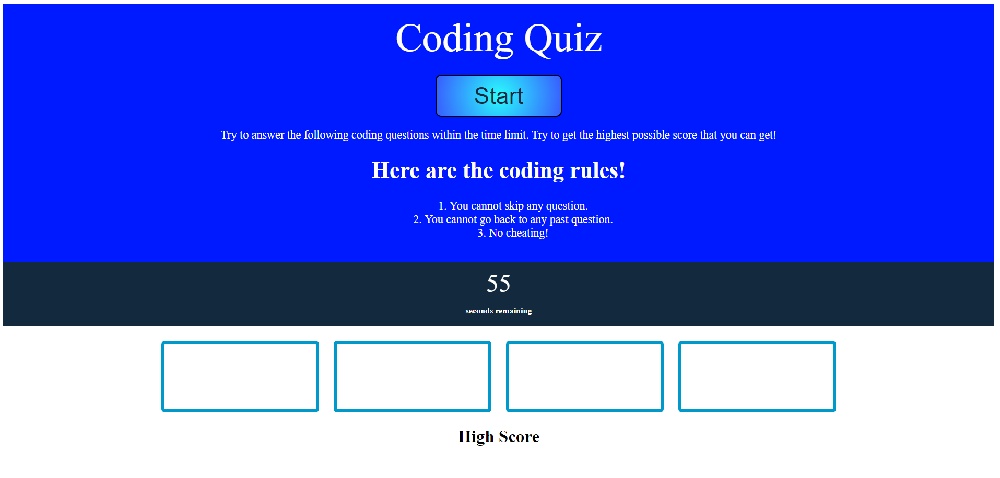
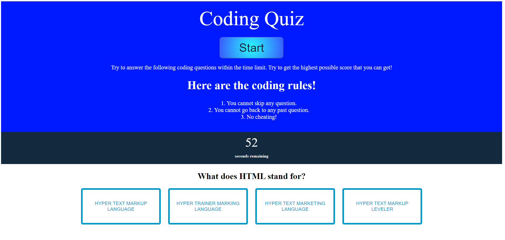
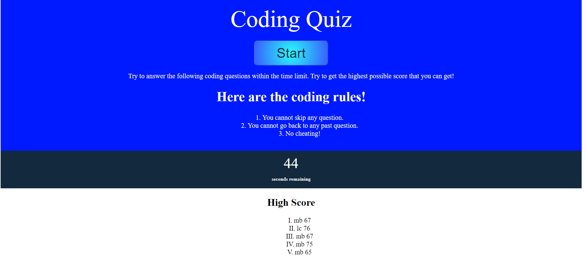

# Code Quiz

## User Story

* AS A coding boot camp student
* I WANT to take a timed quiz on JavaScript fundamentals that stores high scores
* SO THAT I can gauge my progress compared to my peers

## Acceptance Criteria

* GIVEN I am taking a code quiz
* WHEN I click the start button
* THEN a timer starts and I am presented with a question
* WHEN I answer a question
* THEN I am presented with another question
* WHEN I answer a question incorrectly
* THEN time is subtracted from the clock
* WHEN all questions are answered or the timer reaches 0
* THEN the game is over
* WHEN the game is over
* THEN I can save my initials and score

## Description

This application is a computer programming quiz. You must answer all the questions with the given amount of time. Any wrong answer will reduce the amount of time you have left. Your final score depends on the number of questions you answer correctly and how much time you have left. At the end, your final score will be saved and added to list of high scores.

    

### Screenshots
Below is the starter page when the application is first loaded.

This is what the application looks like when the quiz begins.

This is the final page that displays the high scores.
